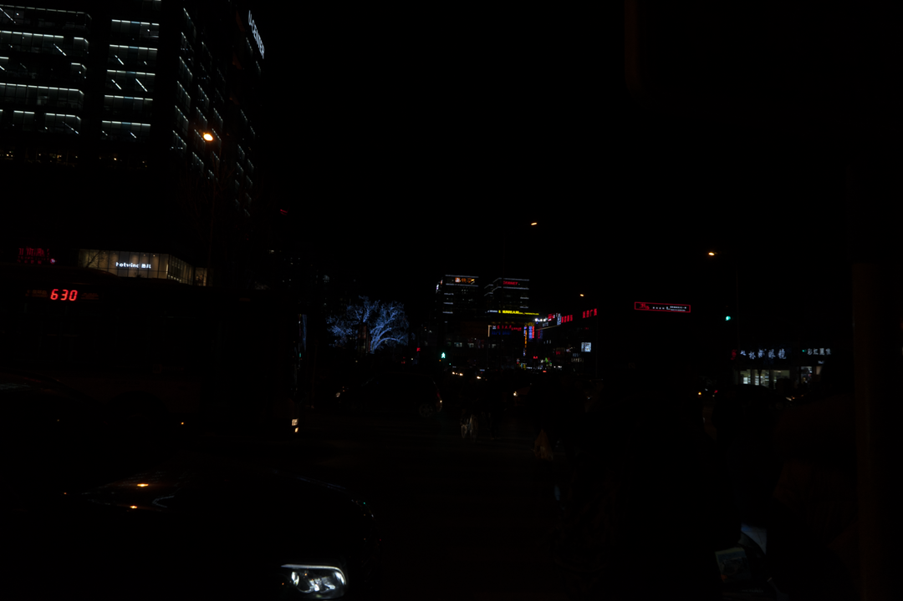
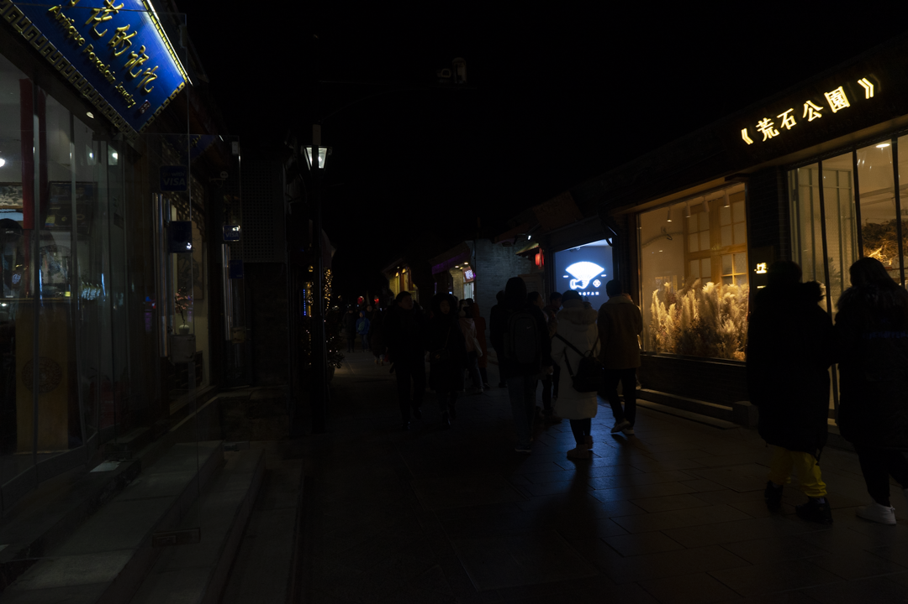
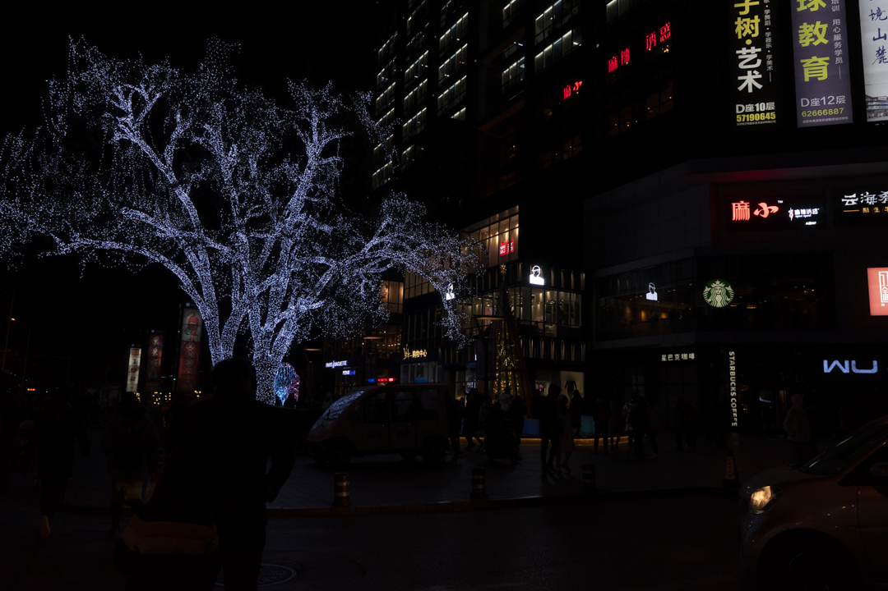
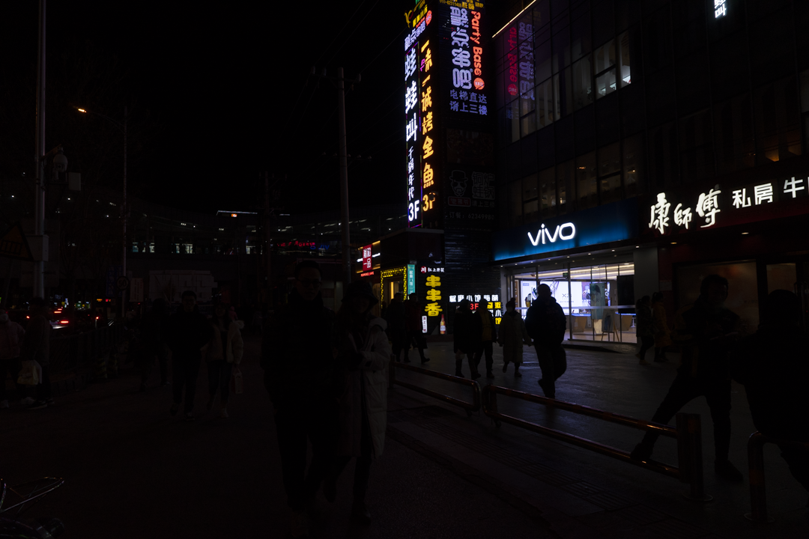

# Mejora de imágenes en condiciones de baja iluminación

**Actividad 1 — Visión Artificial**
**Máster Universitario en Inteligencia Artificial — UNIR**

Este repositorio implementa y compara técnicas clásicas de mejora de imagen sobre cuatro fotografías reales con iluminación deficiente, seleccionadas del conjunto de datos **DARK FACE**. El estudio analiza tres familias de procesamiento: ajuste de intensidad, procesamiento del histograma y suavizado/realce mediante operadores aritméticos.

El propósito no es elegir una técnica únicamente por el aumento del brillo, sino estudiar sus efectos sobre el contraste, la información tonal, el ruido y la naturalidad visual de cada escena.

## Objetivos

* Aplicar funciones de transformación de intensidad a imágenes con distintos niveles de subexposición.
* Comparar la ecualización global del histograma con una estrategia adaptativa local.
* Analizar operaciones aritméticas para modificar brillo, corregir iluminación desigual y realzar detalles.
* Evaluar cuantitativamente los resultados mediante métricas sin referencia.
* Identificar ventajas, limitaciones y posibles artefactos de cada técnica.

## Conjunto de imágenes

Las cuatro imágenes empleadas son fotografías nocturnas reales de **1080 × 720 píxeles** y tres canales de color. En el repositorio se almacenan con nombres descriptivos:

| Imagen                    | Archivo                            |
| ------------------------- | ---------------------------------- |
| Calle nocturna            | `images/img1_calle_nocturna.png`   |
| Callejón o mercado        | `images/img2_callejon_mercado.png` |
| Plaza con luces puntuales | `images/img3_plaza_luces.png`      |
| Calle comercial           | `images/img4_calle_comercial.png`  |

|                                                   |                                                         |
| ------------------------------------------------- | ------------------------------------------------------- |
|  |  |
|    |      |

Las imágenes proceden de la distribución de [Dark Face Dataset en Kaggle](https://www.kaggle.com/datasets/soumikrakshit/dark-face-dataset). El proyecto oficial describe DARK FACE como un conjunto de 6.000 imágenes reales de baja iluminación capturadas durante la noche en calles, edificios, puentes, parques y otros espacios, con anotaciones de rostros para entrenamiento y validación. Puede consultarse la [página oficial del conjunto DARK FACE](https://flyywh.github.io/CVPRW2019LowLight/).

> **Nota de atribución:** las imágenes no son de autoría propia y se incorporan únicamente con fines académicos. Sus condiciones de uso y redistribución dependen de la fuente original. Una eventual licencia del código de este repositorio no debe interpretarse como aplicable a las imágenes del dataset.

## Técnicas implementadas

El módulo [`pipeline.py`](pipeline.py) reúne nueve transformaciones concretas. El suavizado gaussiano se utiliza como operación intermedia en el enmascaramiento de enfoque y en la estimación de la iluminación.

| Familia                | Técnica                    | Parámetros usados                     | Finalidad principal                                                                       |
| ---------------------- | -------------------------- | ------------------------------------- | ----------------------------------------------------------------------------------------- |
| Ajuste de intensidad   | Negativo                   | —                                     | Invertir los niveles de intensidad como referencia didáctica.                             |
| Ajuste de intensidad   | Transformación logarítmica | Escala normalizada a `[0, 255]`       | Expandir niveles oscuros y comprimir intensidades altas.                                  |
| Ajuste de intensidad   | Corrección gamma           | `gamma = 0.4`                         | Aclarar regiones subexpuestas mediante una transformación no lineal.                      |
| Ajuste de intensidad   | Estiramiento de contraste  | Percentiles 2 y 98                    | Redistribuir el rango tonal y limitar la influencia de valores extremos.                  |
| Histograma             | Ecualización global        | Canal Y de YCrCb                      | Redistribuir globalmente la luminancia sin ecualizar por separado los canales RGB.        |
| Histograma             | CLAHE                      | `clipLimit = 2.0`, cuadrícula `8 × 8` | Mejorar el contraste local limitando la amplificación excesiva.                           |
| Operadores aritméticos | Ajuste lineal              | `alpha = 1.3`, `beta = 25`            | Aumentar contraste y brillo mediante multiplicación y suma.                               |
| Operadores aritméticos | Unsharp masking            | `sigma = 3`, `amount = 1.5`           | Realzar bordes a partir de la resta de una versión suavizada.                             |
| Operadores aritméticos | Corrección por división    | `sigma = 31`, `gain = 128`            | Compensar iluminación espacialmente desigual mediante una estimación suavizada del fondo. |

## Evaluación cuantitativa

La evaluación utiliza tres métricas sin referencia, calculadas sobre la representación en escala de grises de cada resultado:

* **Brillo medio:** media aritmética de los niveles de intensidad.
* **Contraste RMS:** desviación estándar de las intensidades.
* **Entropía de Shannon:** medida de diversidad o información tonal.

La siguiente tabla resume el promedio obtenido sobre las cuatro imágenes:

| Condición                              | Brillo medio | Contraste RMS | Entropía |
| -------------------------------------- | -----------: | ------------: | -------: |
| Original                               |        10.86 |         24.30 |     4.07 |
| Negativo                               |       244.14 |         24.30 |     4.07 |
| Logarítmica                            |        68.10 |         48.26 |     5.93 |
| Gamma 0.4                              |        47.82 |         36.74 |     5.61 |
| Estiramiento por percentiles           |        24.47 |         46.44 |     5.08 |
| Ecualización global                    |       102.72 |         75.96 |     4.01 |
| CLAHE                                  |        23.32 |         32.67 |     4.82 |
| Ajuste lineal                          |        38.43 |         28.95 |     4.25 |
| Unsharp masking                        |        11.57 |         31.39 |     3.78 |
| Corrección de iluminación por división |        81.39 |         76.41 |     6.15 |

El cuaderno genera además `resultados_metricas.csv`, que contiene los valores por imagen y por técnica.

### Lectura de los resultados

* Las transformaciones logarítmica y gamma incrementan el brillo y la entropía sin alcanzar los cambios extremos de la ecualización global.
* La ecualización global produce un aumento intenso del contraste, pero puede amplificar ruido y generar una apariencia poco natural en escenas con iluminación no uniforme.
* CLAHE ofrece una mejora local más moderada y controla la sobreamplificación mediante el límite de contraste.
* El enmascaramiento de enfoque aumenta el contraste de bordes, pero por sí solo no recupera información ausente en regiones muy oscuras y puede reforzar ruido.
* La corrección por división obtiene los mayores promedios de contraste y entropía, aunque su salida actual es monocromática y puede introducir artefactos donde la estimación de iluminación es inestable.
* El negativo conserva el contraste RMS y la entropía de la imagen original; su alto brillo medio no implica una mejora visual natural.

Estas métricas describen propiedades estadísticas, pero no constituyen por sí solas una medida completa de calidad perceptual. Por ello, su interpretación debe acompañarse de inspección visual.

## Estructura del repositorio

```text
Mejora-Imagenes-VA-A1-UNIR/
├── Gabriel Morejón - A1 - Mejora_imágenes_dark_face.ipynb
├── pipeline.py
├── README.md
└── images/
    ├── img1_calle_nocturna.png
    ├── img2_callejon_mercado.png
    ├── img3_plaza_luces.png
    └── img4_calle_comercial.png
```

## Requisitos

* Python 3.10 o superior.
* JupyterLab o Jupyter Notebook.
* NumPy.
* OpenCV.
* Matplotlib.
* pandas.
* scikit-image.

## Instalación y ejecución

1. Clonar el repositorio:

   ```bash
   git clone https://github.com/elgabo82/Mejora-Imagenes-VA-A1-UNIR.git
   cd Mejora-Imagenes-VA-A1-UNIR
   ```

2. Crear y activar un entorno virtual:

   ```bash
   python -m venv .venv
   source .venv/bin/activate
   ```

   En Windows PowerShell:

   ```powershell
   .venv\Scripts\Activate.ps1
   ```

3. Instalar las dependencias mínimas:

   ```bash
   python -m pip install --upgrade pip
   python -m pip install jupyterlab numpy opencv-python matplotlib pandas scikit-image
   ```

4. Iniciar JupyterLab:

   ```bash
   jupyter lab
   ```

5. Abrir [`Gabriel Morejón - A1 - Mejora_imágenes_dark_face.ipynb`](Gabriel%20Morej%C3%B3n%20-%20A1%20-%20Mejora_im%C3%A1genes_dark_face.ipynb) y ejecutar todas las celdas en orden.

El cuaderno presupone que el directorio de trabajo es la raíz del repositorio, ya que importa `pipeline.py` y carga las imágenes mediante rutas relativas.

## Uso del módulo de procesamiento

Las funciones también pueden reutilizarse fuera del cuaderno:

```python
import cv2
from pipeline import gamma_transform, clahe_color, compute_metrics

bgr = cv2.imread("images/img1_calle_nocturna.png")
rgb = cv2.cvtColor(bgr, cv2.COLOR_BGR2RGB)

resultado_gamma = gamma_transform(rgb, gamma=0.4)
resultado_clahe = clahe_color(rgb, clip_limit=2.0, tile_grid_size=(8, 8))

print(compute_metrics(resultado_gamma))
print(compute_metrics(resultado_clahe))
```

## Limitaciones

* El análisis utiliza únicamente cuatro imágenes seleccionadas de manera intencional; los resultados no deben generalizarse a todo DARK FACE.
* No se dispone de imágenes de referencia correctamente expuestas para las cuatro escenas; por ello no se calculan PSNR ni SSIM.
* Los parámetros se mantienen fijos para facilitar la comparación, aunque su valor óptimo puede variar según la escena.
* Brillo, contraste RMS y entropía no evalúan directamente naturalidad del color, ruido, artefactos ni utilidad para una tarea posterior de detección.
* La corrección por división se aplica actualmente en escala de grises.
* Los archivos fueron renombrados con fines descriptivos; conviene documentar también sus identificadores originales para asegurar trazabilidad completa dentro del dataset.

## Posibles mejoras

* Añadir un archivo `requirements.txt` con versiones verificadas de las dependencias.
* Conservar la correspondencia entre cada nombre local y el nombre original del archivo en DARK FACE.
* Separar las salidas generadas en un directorio `results/` e incluir comparaciones visuales representativas.
* Incorporar métricas sin referencia orientadas a calidad perceptual, como NIQE o BRISQUE, y análisis explícito del ruido.
* Evaluar un subconjunto mayor y documentar el criterio de muestreo.
* Explorar selección adaptativa de gamma, CLAHE por luminancia y métodos basados en Retinex.
* Comprobar si la mejora visual también beneficia una tarea de alto nivel, como la detección de rostros.

## Transparencia sobre el uso de IA

El cuaderno declara el uso de Claude (Anthropic) como apoyo para estructurar el flujo de trabajo y redactar comentarios. El autor revisó, ejecutó y verificó las celdas y los resultados. La responsabilidad académica sobre el contenido, las decisiones metodológicas y las conclusiones corresponde al autor.

## Autor

**Gabriel Eduardo Morejón López**
Máster Universitario en Inteligencia Artificial — UNIR

## Referencias y atribución

* Yang, W., Yuan, Y., Ren, W., et al. (2020). *Advancing Image Understanding in Poor Visibility Environments: A Collective Benchmark Study*. IEEE Transactions on Image Processing, 29, 5737–5752. https://doi.org/10.1109/TIP.2020.2981922
* [DARK FACE: Face Detection in Low Light Condition — sitio oficial](https://flyywh.github.io/CVPRW2019LowLight/)
* [Dark Face Dataset — distribución consultada en Kaggle](https://www.kaggle.com/datasets/soumikrakshit/dark-face-dataset)

## Licencia

El repositorio no incluye actualmente un archivo de licencia. Antes de autorizar la reutilización del código, se recomienda incorporar una licencia explícita y diferenciarla de las condiciones aplicables a las imágenes procedentes de DARK FACE.
